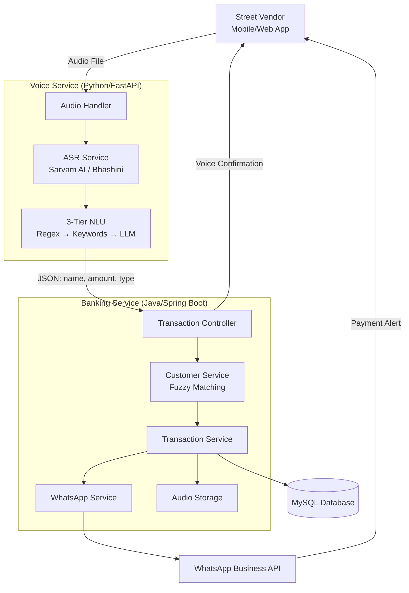
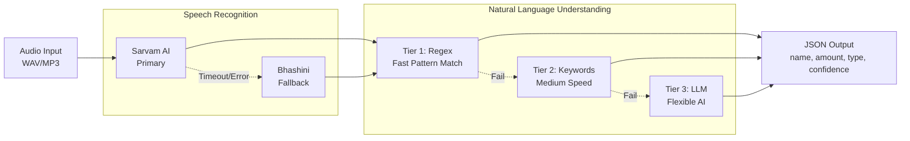
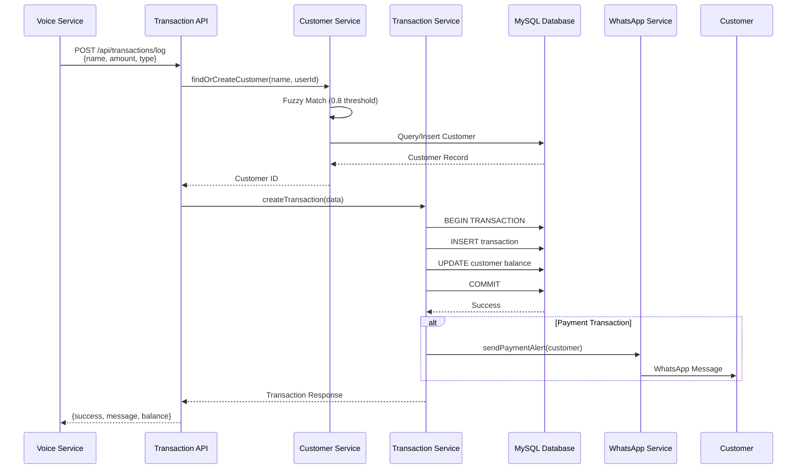
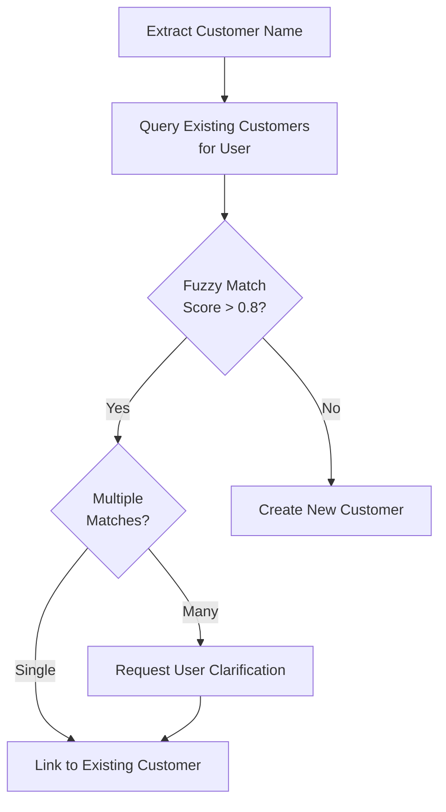
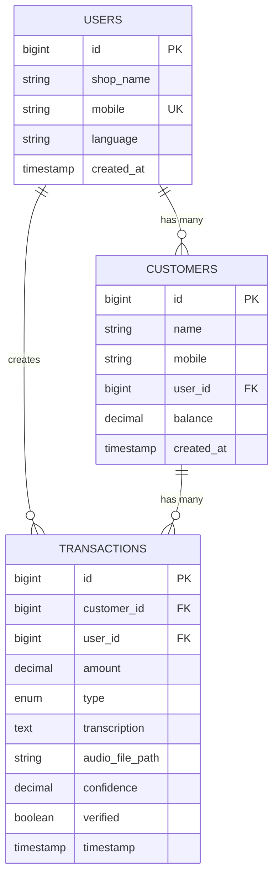
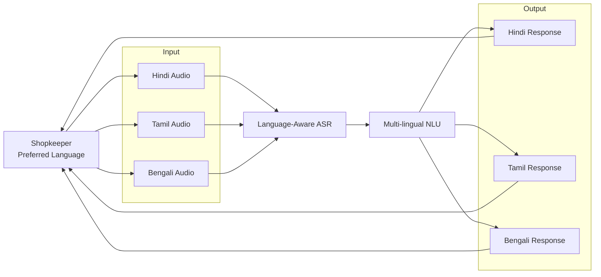
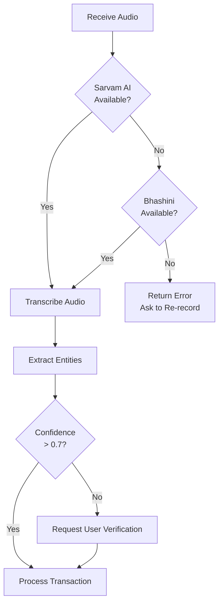
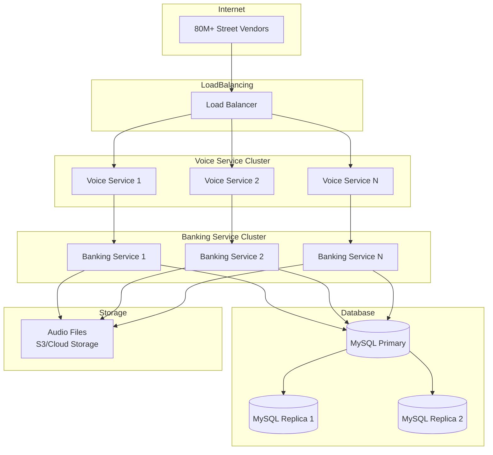

# Bol-Khata Architecture Diagrams

## High-Level System Architecture

## Detailed Voice Service Flow

## Banking Service Transaction Flow

## Customer Fuzzy Matching Algorithm

## Data Model Relationships

## Multi-Language Support Flow

## Error Handling & Fallback Strategy

## Deployment Architecture (Future)

