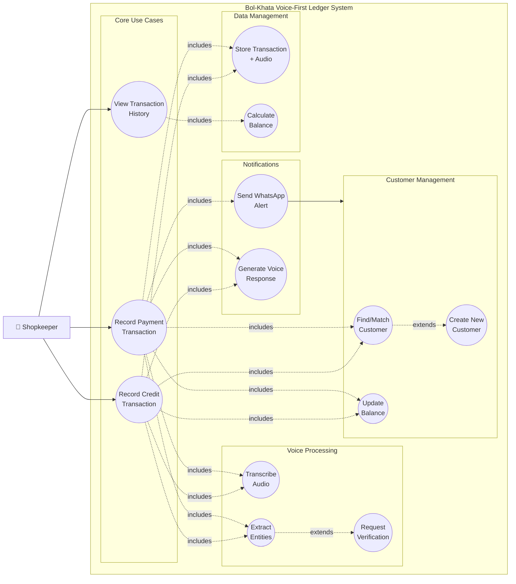

# Bol-Khata Use Cases

## Actors

### Primary Actors
1. **Shopkeeper (Street Vendor)**: Semi-literate vendor who uses the system to track customer credit and payments
2. **Customer**: Person who buys goods on credit and makes payments

### Secondary Actors
3. **System**: Automated processes (ASR, NLU, notifications)
4. **External Services**: Sarvam AI, Bhashini, WhatsApp Business API

---

## Use Case Diagram

---

## Detailed Use Cases

### UC-01: Record Credit Transaction (Udhaar)

**Actor**: Shopkeeper

**Preconditions**: 
- Shopkeeper is authenticated
- Mobile/web app is open

**Main Flow**:
1. Shopkeeper speaks: "Ramesh ne 50 rupay udhaar liye" (Ramesh took 50 rupees credit)
2. System records audio
3. System transcribes audio using Sarvam AI/Bhashini
4. System extracts: name="Ramesh", amount=50, type="CREDIT"
5. System finds/creates customer "Ramesh"
6. System creates transaction record with audio evidence
7. System updates Ramesh's balance (+50)
8. System responds: "Ramesh ka 50 rupay udhaar record ho gaya. Total baaki: 150 rupay"

**Alternate Flows**:
- 3a. Transcription confidence < 0.7: Request shopkeeper verification
- 4a. Entity extraction fails: Ask shopkeeper to repeat
- 5a. Multiple similar customer names: Ask for clarification

**Postconditions**:
- Transaction recorded in database
- Audio file stored
- Customer balance updated
- Voice confirmation played

**Includes**: Transcribe Audio, Extract Entities, Find Customer, Store Transaction, Update Balance, Generate Voice Response

---

### UC-02: Record Payment Transaction (Jama)

**Actor**: Shopkeeper

**Preconditions**: 
- Shopkeeper is authenticated
- Customer has outstanding balance

**Main Flow**:
1. Shopkeeper speaks: "Ramesh ne 30 rupay diye" (Ramesh gave 30 rupees)
2. System records audio
3. System transcribes audio
4. System extracts: name="Ramesh", amount=30, type="PAYMENT"
5. System finds customer "Ramesh"
6. System creates transaction record
7. System updates Ramesh's balance (-30)
8. System sends WhatsApp alert to Ramesh
9. System responds: "Ramesh ka 30 rupay payment record ho gaya. Baaki raashi: 120 rupay"

**Alternate Flows**:
- 7a. Payment > outstanding balance: Accept overpayment, balance becomes negative
- 8a. Customer has no mobile number: Skip WhatsApp alert
- 8b. WhatsApp API fails: Log error, continue transaction

**Postconditions**:
- Payment recorded
- Balance reduced
- WhatsApp notification sent
- Voice confirmation played

**Includes**: Transcribe Audio, Extract Entities, Find Customer, Store Transaction, Update Balance, Send WhatsApp Alert, Generate Voice Response

---

### UC-03: View Transaction History

**Actor**: Shopkeeper

**Preconditions**: 
- Shopkeeper is authenticated

**Main Flow**:
1. Shopkeeper opens transaction history screen
2. System retrieves all transactions for authenticated user
3. System calculates current balances for each customer
4. System displays transactions with customer names, amounts, types, dates
5. Shopkeeper can filter by customer, date range, or transaction type
6. Shopkeeper can play audio evidence for any transaction

**Postconditions**:
- Transaction history displayed
- Balances calculated correctly

**Includes**: Calculate Balance

---

### UC-04: Transcribe Audio

**Actor**: System

**Preconditions**: 
- Valid audio file received (WAV/MP3)
- Audio contains speech

**Main Flow**:
1. System validates audio format
2. System sends audio to Sarvam AI
3. Sarvam AI returns transcription with confidence score
4. System returns transcription text

**Alternate Flows**:
- 2a. Sarvam AI timeout/error: Fallback to Bhashini API
- 3a. Both APIs fail: Return error to user

**Postconditions**:
- Audio transcribed to text
- Confidence score calculated

---

### UC-05: Extract Entities

**Actor**: System

**Preconditions**: 
- Transcription text available

**Main Flow**:
1. System attempts Tier 1: Regex pattern matching
2. If successful, extract name, amount, type
3. Return extracted entities with confidence score

**Alternate Flows**:
- 1a. Regex fails: Try Tier 2 (Keyword mapping)
- 2a. Keywords fail: Try Tier 3 (LLM extraction)
- 3a. All tiers fail: Return error with confidence 0

**Postconditions**:
- Entities extracted: name, amount, type
- Confidence score calculated

**Extends**: Request Verification (if confidence < 0.7)

---

### UC-06: Request Verification

**Actor**: System, Shopkeeper

**Preconditions**: 
- Transcription or extraction confidence < 0.7

**Main Flow**:
1. System displays extracted information
2. System asks: "Kya yeh sahi hai?" (Is this correct?)
3. Shopkeeper confirms or corrects
4. System proceeds with verified information

**Postconditions**:
- Transaction verified by user
- Verification flag set to true

---

### UC-07: Find/Match Customer

**Actor**: System

**Preconditions**: 
- Customer name extracted from speech

**Main Flow**:
1. System queries existing customers for authenticated user
2. System performs fuzzy matching (Levenshtein distance)
3. If match score > 0.8, return matched customer
4. If no match, trigger Create New Customer

**Alternate Flows**:
- 3a. Multiple matches with similar scores: Ask user for clarification

**Postconditions**:
- Customer identified or created

**Extends**: Create New Customer

---

### UC-08: Create New Customer

**Actor**: System

**Preconditions**: 
- No existing customer matches extracted name

**Main Flow**:
1. System creates new customer record
2. System sets initial balance to 0
3. System associates customer with authenticated user
4. System returns new customer ID

**Postconditions**:
- New customer created
- Balance initialized to 0

---

### UC-09: Update Balance

**Actor**: System

**Preconditions**: 
- Transaction type and amount determined

**Main Flow**:
1. System retrieves current customer balance
2. If CREDIT: balance += amount
3. If PAYMENT: balance -= amount
4. System updates customer balance in database
5. System returns updated balance

**Postconditions**:
- Customer balance updated atomically

---

### UC-10: Store Transaction with Audio

**Actor**: System

**Preconditions**: 
- Transaction details validated
- Audio file available

**Main Flow**:
1. System generates unique filename for audio
2. System stores audio file in persistent storage
3. System creates transaction record with:
   - Customer ID
   - User ID
   - Amount
   - Type (CREDIT/PAYMENT)
   - Transcription
   - Audio file path
   - Confidence score
   - Verification status
   - Timestamp
4. System commits transaction to database

**Alternate Flows**:
- 2a. Audio storage fails: Flag transaction as missing audio, continue

**Postconditions**:
- Transaction persisted
- Audio evidence stored
- File path recorded

---

### UC-11: Calculate Balance

**Actor**: System

**Preconditions**: 
- Customer has transactions

**Main Flow**:
1. System retrieves all transactions for customer
2. System sums all CREDIT transactions
3. System sums all PAYMENT transactions
4. Balance = CREDIT_SUM - PAYMENT_SUM
5. System returns calculated balance

**Postconditions**:
- Accurate balance calculated

---

### UC-12: Send WhatsApp Alert

**Actor**: System, Customer

**Preconditions**: 
- Payment transaction recorded
- Customer has mobile number

**Main Flow**:
1. System formats message in customer's language
2. Message includes: amount paid, updated balance
3. System sends message via WhatsApp Business API
4. Customer receives notification

**Alternate Flows**:
- 1a. Customer has no mobile: Skip notification
- 3a. WhatsApp API fails: Log error, don't block transaction

**Postconditions**:
- Customer notified of payment

---

### UC-13: Generate Voice Response

**Actor**: System, Shopkeeper

**Preconditions**: 
- Transaction processed successfully

**Main Flow**:
1. System retrieves shopkeeper's language preference
2. System formats response message with:
   - Customer name
   - Transaction amount
   - Transaction type
   - Updated balance
3. System converts text to speech (TTS)
4. System plays audio response to shopkeeper

**Postconditions**:
- Shopkeeper receives audio confirmation

---

## Use Case Relationships

### Includes Relationships
- Record Credit **includes** Transcribe Audio
- Record Credit **includes** Extract Entities
- Record Credit **includes** Find Customer
- Record Credit **includes** Store Transaction
- Record Credit **includes** Update Balance
- Record Credit **includes** Generate Voice Response
- Record Payment **includes** all of the above + Send WhatsApp Alert

### Extends Relationships
- Extract Entities **extends to** Request Verification (when confidence < 0.7)
- Find Customer **extends to** Create New Customer (when no match found)

---

## Non-Functional Requirements Covered

### Performance
- UC-04: Transcription within 2 seconds
- UC-05: Entity extraction within 500ms
- UC-10: Transaction storage within 500ms

### Scalability
- All use cases: Support 100+ concurrent shopkeepers
- UC-10: Handle 1000+ transactions per minute

### Reliability
- UC-04: 95%+ transcription accuracy
- UC-07: 80%+ fuzzy match accuracy
- UC-10: Zero data loss (ACID transactions)

### Security
- All use cases: User authentication required
- All use cases: Data isolation by user_id
- UC-10: Audio evidence for dispute resolution

### Usability
- UC-01, UC-02: Voice-first, no typing required
- UC-04: Multi-language support (Hindi, Tamil, Bengali)
- UC-13: Voice confirmation in user's language
